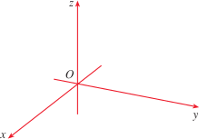

# Unit 1: Vectors and Geometry
# Representing points in space
- Fixed point $O$ as origin
- **Right-hand rule** = Determine direction of z-axis

## Coordinate Planes
- $xy$-plane is a plane that **contains the $x-$ and $y-$ axes**
- Entire 3D space is divided into **octants**
    - Can be describing using the positivity of $(a, b, c )$
    - First octant is the **set of all points whose coords are positive**

## Point in space
- $P$ is a point in space
- $a$ is distance from $yz$-plane to $P$
- $b$ is distance from $xz$-plane to $P$
- $c$ is distance from $xy$-plane to $P$
- $P = (a, b, c)$

- $P(a, b, c)$ determines a rectangular box as such

- $Q(a, b, 0), S(a, 0, c), R(0, b, c)$ are **projections** of $P$ onto their respective planes

- **Cartesian product** $$\mathbb{R}^3 = \mathbb{R} \times \mathbb{R} \times \mathbb{R} = \{(x, y, z) | x, y, z \in \mathbb{R}\}$$
    - Is the set of all ordered triples of **real numbers**
- 1-to-1 correspondnece between points $P$ in space and $(a, b, c)$ in $\mathbb{R}^3$
    - **Three-dimensional coordinate system**

# Surfaces and Solids
## Graphing - Plants
- Graph of an equation involving $x$ and $y$ is a curve in $\mathbb{R}^2$
    - Similarly, involving $x, y, z$ $\rightarrow$ $\mathbb{R}^3$
- $z = 3$ and $y=5$ are all planes in $\mathbb{R}^3$
    - $z = 3$ represents $\{(x, y, z) | z = 3\}$

- When an equation is given, make the distinction between $\mathbb{R}^2$ and $\mathbb{R}^3$

## Graphing - Lines
- Which points $(x, y, z)$ satisfy $x^2 + y^2 = 1$ **and** $z = 3$?
    - $z = 3$, all points lie on plane $z=3$
    - $x^2+y^2 = 1$, all points line on circle with $r=1$ and center on $z$-axis
    - 
- If we are just given $x^2 + y^2 = 1$,
    - 
    - $y = x$
        - 
# Distance
- Distance $|P_1P_2|$ between $P_1(x_1, y_1, z_1)$ and $P_2(x_2, y_2, z_2)$ is
$$|P_1P_2| = \sqrt{(x_2 - x_1)^2 + (y_2 - y_1)^2 + (z_2 - z_1)^2}$$

- $P_1$ and $P_2$ are opposite vertices, faces of the box are **parallel to coordinate planes**

# Spheres
- Sphere with radius $r$ and center $C(h, k, l)$ is defined as the set of all points $P(x, y, z)$ whose distance from $C$ is $r$
$$r = \sqrt{x-h)^2 + (y-k)^2 + (z-l)^2}$$

- If $C$ is origin $O$,$$x^2 + y^2 + z^2 = r^2$$
# Inequalities