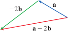

# Unit 2: Vectors
- **Vector** = magnitude + direction
    - Velocity, Force, Displacement, Acceleration

# Geometry of Vectors
- **v**  or $\vec{v}$
- $\vec{v}$ has **initial point $A$** and **terminal point $B$**
    - **v** = $\vec{AB}$
- **Zero vector** = length $0$
- Equivalent vectors $\bold{v} = \bold{u}$
    - 

# Addition of Vectors
- $\vec{AC} = \vec{AB} + \vec{BC}$
- **Head-to-tail/Triangle law**
- 
- **Parallelogram law**
- 
# Scalar Multiplcation
- $c\bold{V}$
- 
- $\bold{u} - \bold{v} = \bold{u} + (-\bold{v})$
- 
- 

# Components of a Vector
$$\bold{a} = \langle a_1, a_2, \rangle, \bold{a} = \langle a, b, c \rangle$$
- This is the displacement of the vector from the initial to final point

- Representations of $\bold{a} = \langle 3, 2 \rangle$
- 
- 
- Given points $A(x_1, y_1, z_1)$ and $B(x_2, y_2, z_2)$, vector $\bold{a}$ with representation $\vec{AB}$ is $$\bold{a} = \langle x_2 - x_1, y_2 - y_1, z_2 - z_1 \rangle$$
- **Magnitude/length $||v||$**

# Everything else!!